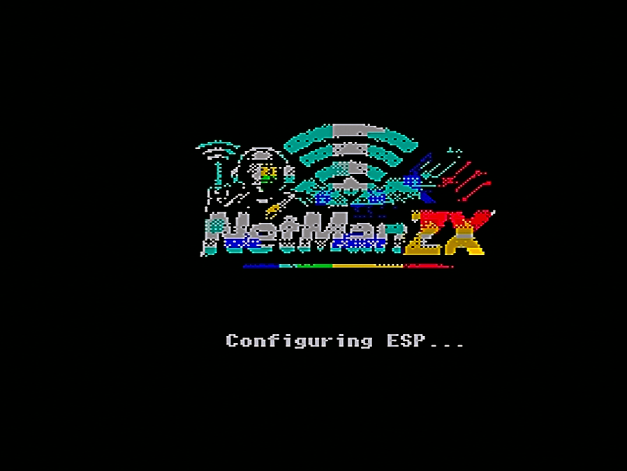
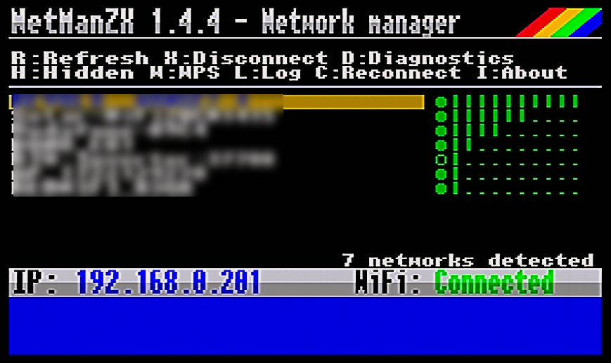
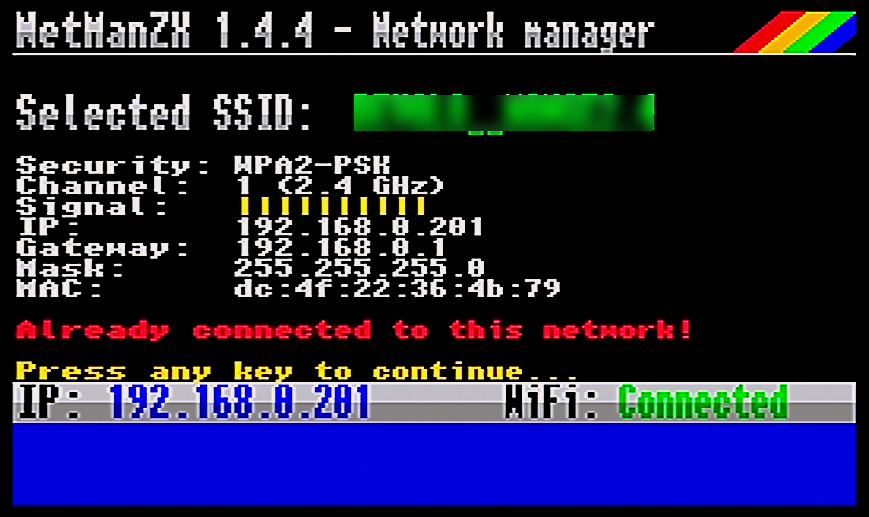
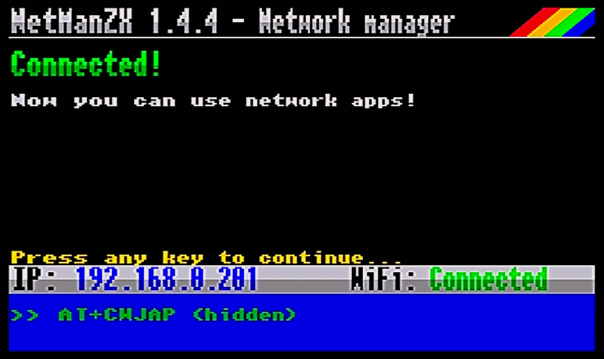
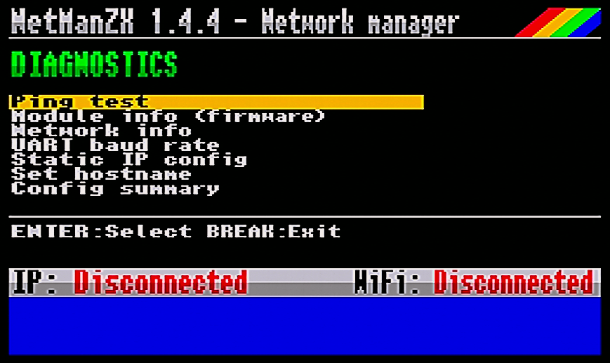
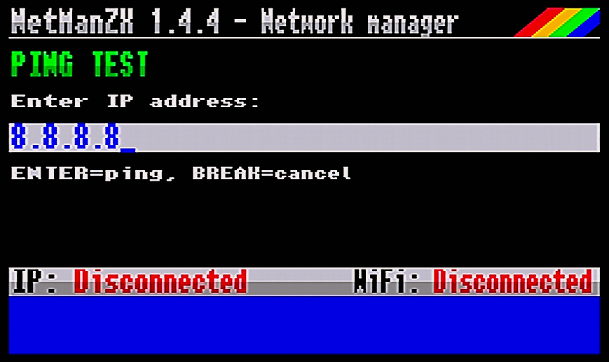
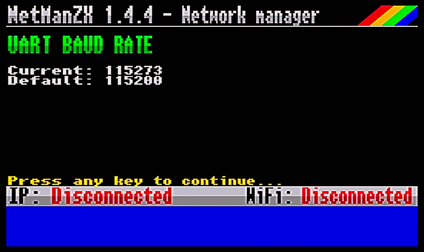
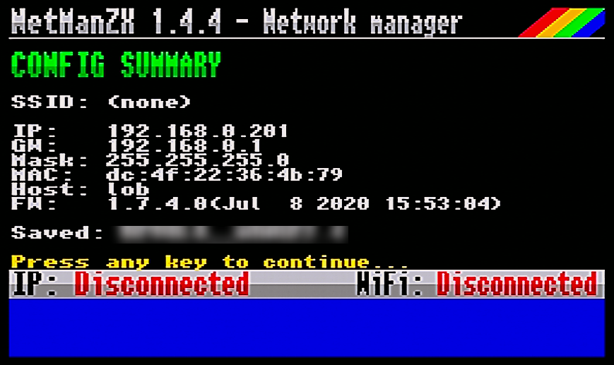
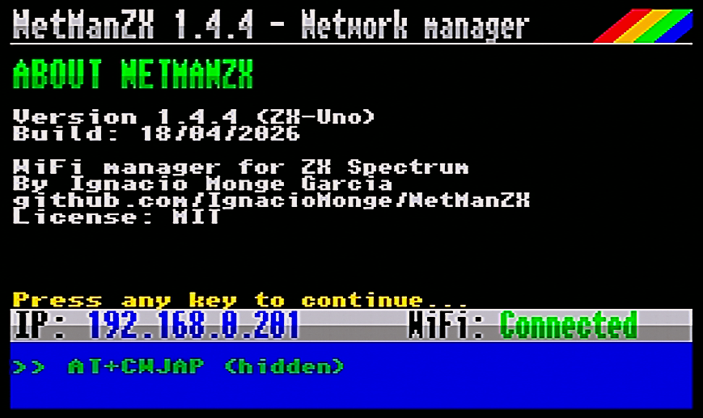

# NetManZX

**WiFi Network Manager for ZX Spectrum**

[Version en espanol](READMEsp.md)

## What is NetManZX?

NetManZX is a WiFi network configuration utility for ZX Spectrum computers equipped with ESP8266-based WiFi modules. It supports divMMC-based systems (such as DivTIESUS, ZX-Badaloc, or similar), ZX-Uno, and ZX Spectrum Next. It provides a user-friendly interface to scan, select, and connect to wireless networks directly from your Spectrum.

## Origin

NetManZX is based on the original [netman-zx](https://github.com/nihirash/netman-zx) project by **Alex Nihirash**. This version has been significantly enhanced with new features, improved reliability, and a better user experience.

## Screenshots

*Screenshots from v1.4.4. SSIDs in captures have been blurred for privacy.*

| | | |
|:---:|:---:|:---:|
| [](images/1.4.4/release/01_splash_next.png) | [](images/1.4.4/release/03_network_list.png) | [](images/1.4.4/release/04_already_connected.png) |
| *Boot splash (Spectrum Next, Layer 2)* | *Network list with RSSI bars* | *"Already connected" warning (v1.4.4)* |
| [](images/1.4.4/release/10_connected.png) | [](images/1.4.4/release/06_diagnostics_menu.png) | [](images/1.4.4/release/07_ping_test.png) |
| *Successful connection* | *Diagnostics menu (7 options)* | *Ping test* |
| [](images/1.4.4/release/08_uart_baud.png) | [](images/1.4.4/release/09_config_summary.png) | [](images/1.4.4/release/11_about.png) |
| *UART baud (current / default)* | *Configuration summary* | *About screen* |

## Features

### Network Management
- **Network Scanning**: Automatically discovers up to 25 WiFi networks using extended scan parameters (`AT+CWLAP` with 200-1500ms dwell time) for better coverage. Retry with fallback on scan failure. Sorted by signal strength
- **Robust startup detection**: Disables ESP echo early (ATE0) to prevent scan parser failures on cold boot. Multiple scan attempts with diagnostic messages on timeout or empty results
- **Hidden Network Support**: Manually enter SSID for networks that do not broadcast their name
- **Smart Connection Detection**: On startup, detects if already connected and offers to keep or reconfigure (with direct access to diagnostics)
- **Connection info screen**: Press ENTER on the already-connected network to view full connection details: IP address, gateway, netmask, and MAC address
- **Save & Reconnect** (C key, UNO/NEXT only): Save WiFi credentials to SD card (`/SYS/CONFIG/NETMAN.CFG`). Press C from the main menu to reconnect to the saved network with one keypress. Save prompt also appears after successful connection (S key). Saved network is highlighted in cyan in the network list
- **Password Entry**: Full keyboard support with show/hide toggle, double-height input with cursor editing (left/right arrow keys)
- **WPS Support**: Push-button WPS connection (W key), with 120-second timeout and BREAK cancellation
- **Disconnect Option**: Disconnect from current network with confirmation dialog, without exiting the application
- **Real-time Status Monitoring**: Automatically detects connection drops and reconnections via async ESP event parsing
- **Connection failure diagnostics**: Specific error messages for connection failures: wrong password, AP not found, timeout, or connection refused
- **BREAK cancellation**: Near-instant cancellation (~5ms response) during any AT command or connection attempt

### Diagnostics Menu
1. **Ping test** - Test connectivity with configurable target IP (default: 8.8.8.8)
2. **Module info** - Display ESP8266 firmware version and AT command set
3. **Network info** - Show current IP address and MAC address
4. **UART baud rate** - Display current communication speed
5. **Static IP** - Configure static IP address, gateway, and subnet mask
6. **Hostname** - Set a custom hostname for the ESP module
7. **Config summary** - View all current WiFi settings at a glance (SSID, IP, MAC, hostname, firmware, saved network, app version)

### User Interface
- **Double-height rendering**: Banner, status bar, input fields, and messages all rendered in flicker-free double-height text using a custom pixel-level renderer
- **Network Detail screen**: Detail view shows SSID (double-height), security type, WiFi channel with band indicator (2.4/5 GHz), and signal strength bars before prompting for password
- **Connection progress screen**: "Connecting to..." shows the SSID in double-height yellow text with attempt counter
- **Rainbow badge**: Decorative dither-triangle with color transitions on the banner
- **8-level RSSI signal bars**: Visual WiFi signal strength indicator for each network, with custom lock/open circle glyphs
- **Anti-flicker status bar**: Direct-overwrite rendering with batched updates eliminates visual flickering
- **Scroll indicators**: Visual arrows showing when more networks are available
- **Audible key click**: Clear audible feedback on every keypress during text input

### Other
- **About screen** (I key): Shows version, build date, author, GitHub URL, and license
- **UART Debug Log**: Toggle live UART log display with L key (works globally). Red indicator dot in log area when active
- **Compressed font**: Built-in nibble-packed font system (no external font.bin dependency)
- **Three UART backends**: Supports ZX-Uno, AY-UART (ZX-Badaloc), and ZX Spectrum Next hardware
- **Baud rate auto-detection** (Next only): Scans common baud rates (1152000, 2000000, 9600, 57600) if ESP doesn't respond at 115200, and sets 115200 for the current session via `AT+UART_CUR` (does not modify ESP flash). Falls back to hardware ESP reset if no known rate matches. Handles NextSync/NextSync-fast leftovers, factory ESPs, and user misconfigurations with zero overhead on normal boot
- **NEX format** (Next only): Native `.nex` binary for direct launch without mode selection menu
- **Build date**: Automatically embedded at assembly time via Lua

## Requirements

- ZX Spectrum (48K or higher) or compatible
- ESP8266-based WiFi module:
  - **ZX-Uno**: Built-in UART (default target)
  - **AY-UART**: ZX-Badaloc or similar bit-banged AY-3-8912 implementations
  - **ZX Spectrum Next**: Hardware UART with FIFO
- TAP-compatible loading method (divMMC, esxDOS, emulator, or tap2wav for tape)

## Building

### Prerequisites

- [SjASMPlus](https://github.com/z00m128/sjasmplus) Z80 Cross-Assembler v1.20+
- GNU Make

### Compilation

```bash
# Build for ZX-Uno / DivMMC (default)
make uno

# Build for AY-UART / ZX-Badaloc
make ay

# Build for ZX Spectrum Next
make next

# Build all targets
make all
```

### Output Files

| Target | File | Description |
|--------|------|-------------|
| UNO | `netmanzx-uno.tap` | ZX-Uno / DivMMC |
| AY | `netmanzx-ay.tap` | AY-UART / ZX-Badaloc |
| NEXT | `netmanzx-next.nex` | ZX Spectrum Next (native NEX) |

### Loading

**TAP (tape/emulators):**
Simply load the TAP file - the BASIC loader will auto-run and load the program automatically.

**NEX (Next):**
Copy `netmanzx-next.nex` to your SD card and run it directly from the file browser or command line (`.netmanzx-next`).

## Usage

1. **Load the program** on your Spectrum
2. **Wait for network scan** - available networks will appear in a list
3. **Navigate** using cursor keys (up/down) or Q/A, O/P for page up/down
4. **Select a network** with ENTER - a detail screen shows security, channel, and signal
5. **Enter password** (if required) - use UP arrow to toggle password visibility
6. **Wait for connection** - BREAK cancels immediately, detailed error messages on failure
7. **Access diagnostics** by pressing D from the network list

### Key Controls

| Key | Action |
|-----|--------|
| Up/Down or Q/A | Navigate network list |
| O/P | Page Up/Down |
| ENTER | Select network / Confirm |
| BREAK | Cancel / Back (instant response) |
| H | Connect to hidden network (manual SSID entry) |
| X | Disconnect from current network |
| D | Diagnostics menu |
| R | Rescan networks |
| L | Toggle UART debug log |
| W | WPS push-button connect |
| C | Save config / Reconnect (UNO/NEXT) |
| S | Save credentials after connection (UNO/NEXT) |
| I | About screen |
| ESC | Exit program |

### Connection Robustness

- **BREAK Detection**: BREAK key checked every ~5ms during AT commands for near-instant cancellation. Dedicated "Cancelled" screen with debounce
- **Automatic WiFi Drop Detection**: Asynchronous ESP event parsing detects unexpected disconnections instantly
- **Idle Connection Health Check**: Periodic AT-based link validation with debounce (3 consecutive failures required before declaring disconnection)
- **UART Busy Protection**: Mutex-style guard prevents background async parsing from interfering during critical operations
- **UART Register Safety**: All three UART backends (UNO, AY, Next) preserve caller registers during write operations
- **IP Retry on Connect**: 3 attempts with 1-second intervals after successful WiFi association
- **Automatic State Recovery**: On link loss, UI transitions to Disconnected and schedules a safe rescan. Auto-rescan preserves previous network list on scan failure
- **Bounded Buffer Searches**: All CPIR-based string searches bounded to actual buffer sizes
- **Baud Rate Auto-Detection** (Next only): Scans 1152000, 2000000, 9600, 57600 baud if ESP doesn't respond at 115200. Sets 115200 for the session via `AT+UART_CUR`. Hardware ESP reset as fallback

## Version History

See [CHANGELOG.md](CHANGELOG.md) for detailed version history.

## License

MIT License. See [LICENSE](LICENSE) for details.

Based on original work by Alex Nihirash.

## Copyright

- Original netman-zx: **Alex Nihirash** (https://github.com/nihirash)
- NetManZX enhancements: **M. Ignacio Monge Garcia** (2025-2026)

---

*Made with love for the ZX Spectrum community*
