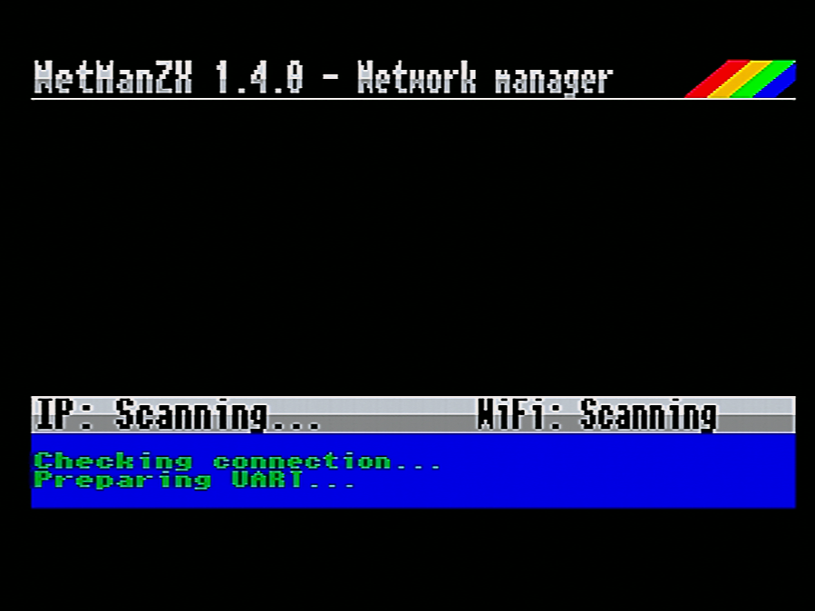
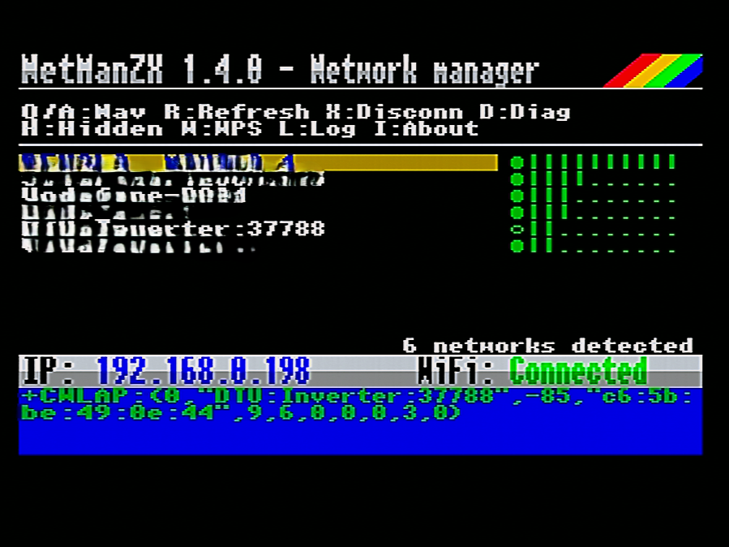
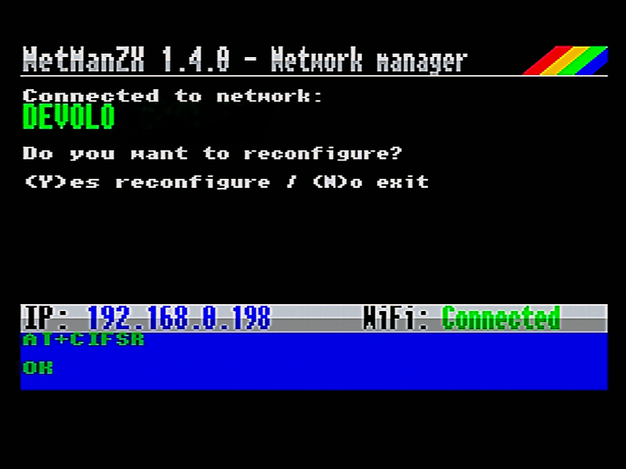
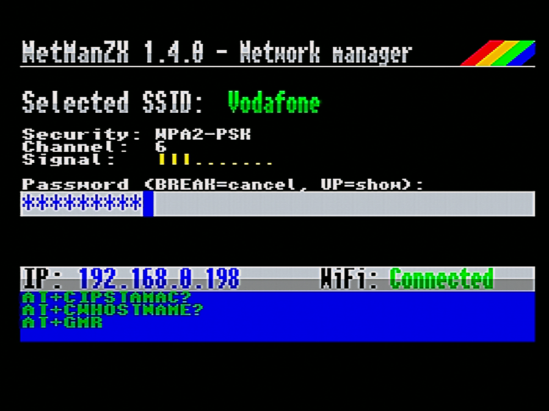
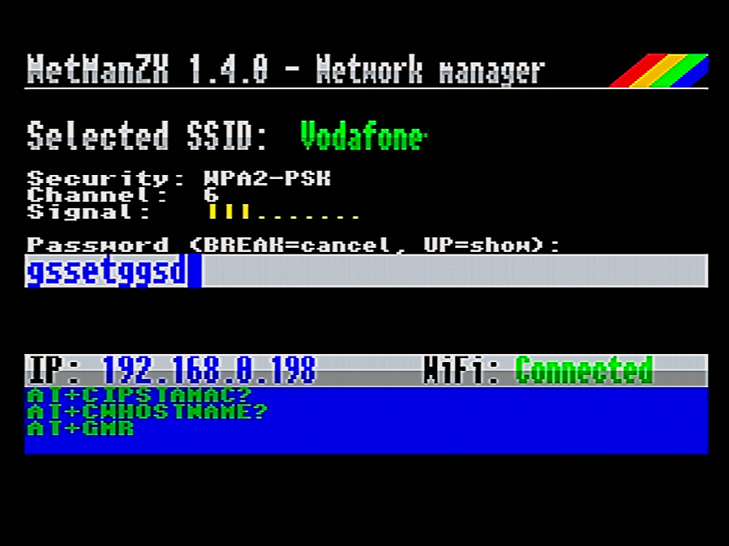
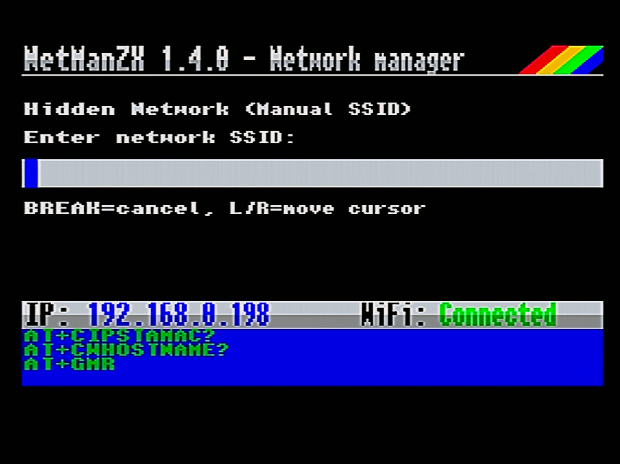
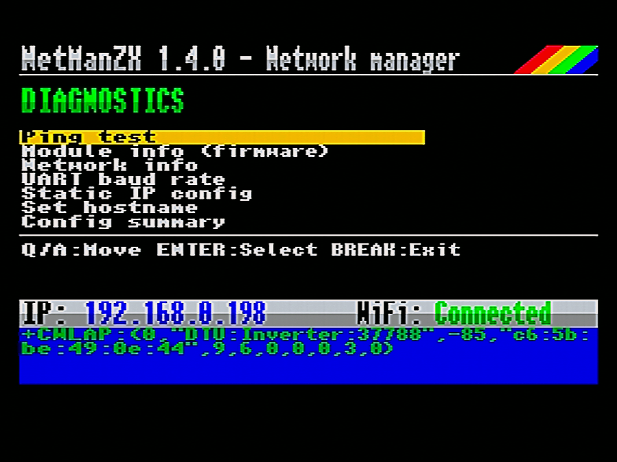
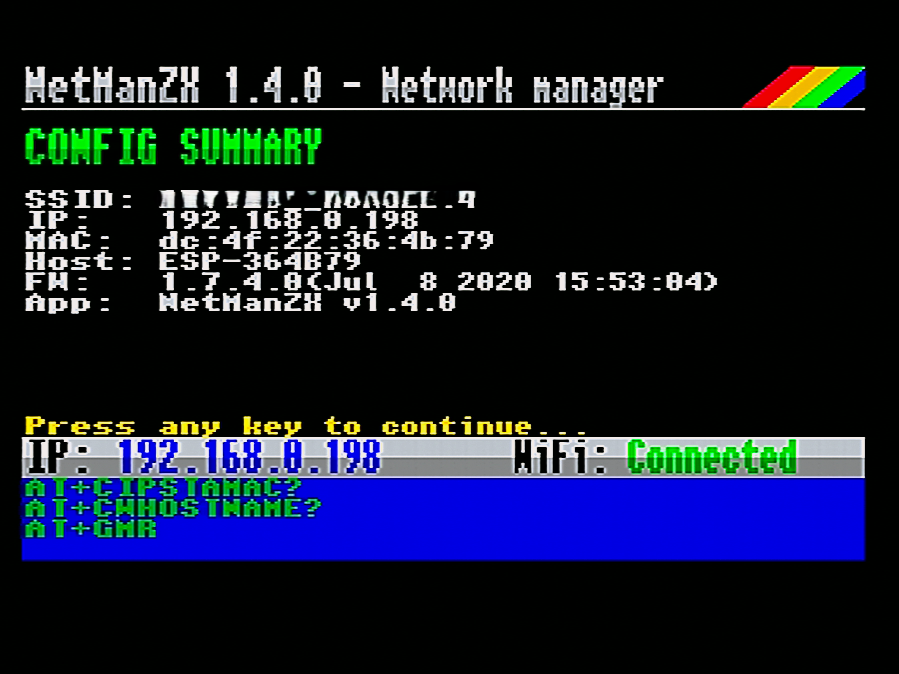
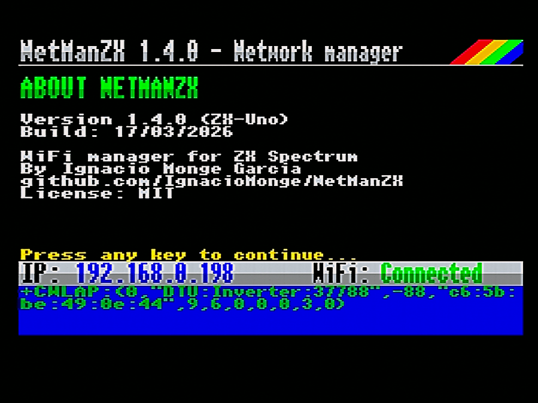

# NetManZX

**WiFi Network Manager for ZX Spectrum**

[Version en espanol](READMEsp.md)

## What is NetManZX?

NetManZX is a WiFi network configuration utility for ZX Spectrum computers equipped with ESP8266-based WiFi modules (such as ditTiesus Pijus Magnificus or similar). It provides a user-friendly interface to scan, select, and connect to wireless networks directly from your Spectrum.

## Origin

NetManZX is based on the original [netman-zx](https://github.com/nihirash/netman-zx) project by **Alex Nihirash**. This version has been significantly enhanced with new features, improved reliability, and a better user experience.

## Screenshots

| | | |
|:---:|:---:|:---:|
| [](images/screenshot_startup.png) | [](images/screenshot_network_list.png) | [](images/screenshot_connected_prompt.png) |
| *Startup and scanning* | *Network list with RSSI bars* | *Already connected prompt* |
| [](images/screenshot_password_masked.png) | [](images/screenshot_password_visible.png) | [](images/screenshot_hidden_network.png) |
| *Network detail and password* | *Password revealed* | *Hidden network (manual SSID)* |
| [](images/screenshot_diagnostics.png) | [](images/screenshot_config_summary.png) | [](images/screenshot_about.png) |
| *Diagnostics menu (7 options)* | *Config summary* | *About screen* |

## Features

### User Interface
- **Double-height rendering**: Banner, status bar, input fields, and messages all rendered in flicker-free double-height text using a custom pixel-level renderer
- **Network Detail screen**: When selecting a network, a detail view shows SSID (double-height), security type, WiFi channel, and signal strength bars before prompting for password
- **Rainbow badge**: Decorative dither-triangle with color transitions on the banner
- **8-level RSSI signal bars**: Visual WiFi signal strength indicator for each network, with custom lock/open circle glyphs
- **Anti-flicker status bar**: Direct-overwrite rendering with batched updates eliminates visual flickering
- **Scroll indicators**: Visual arrows showing when more networks are available

### Network Management
- **Network Scanning**: Automatically discovers available WiFi networks with sorting by signal strength
- **Hidden Network Support**: Manually enter SSID for networks that do not broadcast their name
- **Smart Connection Detection**: On startup, detects if already connected and offers to keep or reconfigure
- **Password Entry**: Full keyboard support with show/hide toggle, double-height input with cursor editing
- **WPS Support**: Push-button WPS connection (W key), with confirmation dialog if already connected
- **Disconnect Option**: Disconnect from current network without exiting the application
- **Real-time Status Monitoring**: Automatically detects connection drops and reconnections
- **Detailed Error Messages**: Specific feedback for connection failures (wrong password, AP not found, timeout, etc.)
- **BREAK cancellation**: Near-instant cancellation (~5ms response) during any AT command or connection attempt

### Diagnostics Menu
1. **Ping test** - Test connectivity with configurable target IP (default: 8.8.8.8)
2. **Module info** - Display ESP8266 firmware version and AT command set
3. **Network info** - Show current IP address and MAC address
4. **UART baud rate** - Display current communication speed
5. **Static IP** - Configure static IP address, gateway, and subnet mask
6. **Hostname** - Set a custom hostname for the ESP module
7. **Config summary** - View all current WiFi settings at a glance (SSID, IP, MAC, hostname, firmware, app version)

### Other
- **About screen** (I key): Shows version, build date, author, GitHub URL, and license
- **UART Debug Log**: Toggle live UART log display with L key (works globally). Red indicator dot in log area when active
- **Compressed font**: Built-in nibble-packed font system (no external font.bin dependency)
- **Three UART backends**: Supports ZX-Uno, AY-UART (ZX-Badaloc), and ZX Spectrum Next hardware
- **NextSync baud recovery** (Next build only): Automatically detects and recovers if ESP was left at wrong baud rate by NextSync
- **Build date**: Automatically embedded at assembly time via Lua

## Requirements

- ZX Spectrum (48K or higher) or compatible
- ESP8266-based WiFi module:
  - **ZX-Uno**: Built-in UART (default target)
  - **AY-UART**: ZX-Badaloc or similar bit-banged AY-3-8912 implementations
  - **ZX Spectrum Next**: Hardware UART with FIFO
- +3DOS compatible system for loading (or tap2wav for tape loading)

## Building

### Prerequisites

- [SjASMPlus](https://github.com/z00m128/sjasmplus) Z80 Cross-Assembler v1.20+
- GNU Make

### Compilation

```bash
# Build for ZX-Uno / DivMMC (default)
make uno

# Build for AY-UART / ZX-Badaloc
make ay

# Build for ZX Spectrum Next
make next

# Build all targets
make all
```

### Output Files

| Target | File | Description |
|--------|------|-------------|
| UNO | `netmanzx-uno.tap` | ZX-Uno / DivMMC |
| AY | `netmanzx-ay.tap` | AY-UART / ZX-Badaloc |
| NEXT | `netmanzx-next.tap` | ZX Spectrum Next |

### Loading

**TAP (tape/emulators):**
Simply load the TAP file - the BASIC loader will auto-run and load the program automatically.

**+3DOS:**
Put NETMANZX.BAS file loader and netmanzx.cod in the same directory. Run NETMANZX.BAS from the esxDOS file browser.

## Usage

1. **Load the program** on your Spectrum
2. **Wait for network scan** - available networks will appear in a list
3. **Navigate** using cursor keys (up/down) or Q/A, O/P for page up/down
4. **Select a network** with ENTER - a detail screen shows security, channel, and signal
5. **Enter password** (if required) - use UP arrow to toggle password visibility
6. **Wait for connection** - BREAK cancels immediately, detailed error messages on failure
7. **Access diagnostics** by pressing D from the network list

### Key Controls

| Key | Action |
|-----|--------|
| Up/Down or Q/A | Navigate network list |
| O/P | Page Up/Down |
| ENTER | Select network / Confirm |
| BREAK | Cancel / Back (instant response) |
| H | Connect to hidden network (manual SSID entry) |
| X | Disconnect from current network |
| D | Diagnostics menu |
| R | Rescan networks |
| L | Toggle UART debug log |
| W | WPS push-button connect |
| I | About screen |
| ESC | Exit program |

### Connection Robustness

- **BREAK Detection**: BREAK key checked every ~5ms during AT commands for near-instant cancellation. Dedicated "Cancelled" screen with debounce
- **Automatic WiFi Drop Detection**: Asynchronous ESP event parsing detects unexpected disconnections instantly
- **Idle Connection Health Check**: Periodic AT-based link validation with debounce (3 consecutive failures required before declaring disconnection)
- **UART Busy Protection**: Mutex-style guard prevents background async parsing from interfering during critical operations
- **UART Register Safety**: All three UART backends (UNO, AY, Next) preserve caller registers during write operations
- **IP Retry on Connect**: 3 attempts with 1-second intervals after successful WiFi association
- **Automatic State Recovery**: On link loss, UI transitions to Disconnected and schedules a safe rescan. Auto-rescan preserves previous network list on scan failure
- **Bounded Buffer Searches**: All CPIR-based string searches bounded to actual buffer sizes
- **NextSync Recovery** (Next build only): Detects ESP left at 1152000 baud by NextSync and auto-resets to correct speed

## Version History

See [CHANGELOG.md](CHANGELOG.md) for detailed version history.

## License

MIT License. See [LICENSE](LICENSE) for details.

Based on original work by Alex Nihirash.

## Copyright

- Original netman-zx: **Alex Nihirash** (https://github.com/nihirash)
- NetManZX enhancements: **M. Ignacio Monge Garcia** (2025-2026)

---

*Made with love for the ZX Spectrum community*
