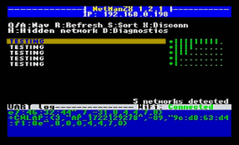
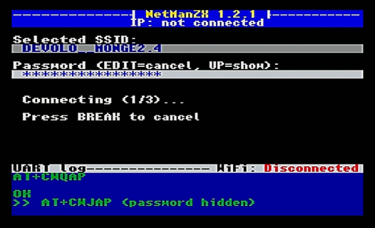
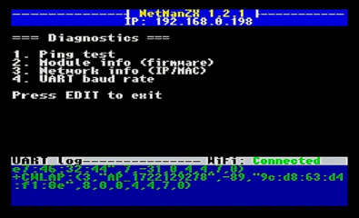

# NetManZX

**Gestor de Redes WiFi para ZX Spectrum**

[🇬🇧 English version](README.md)

## ¿Qué es NetManZX?

NetManZX es una utilidad de configuración de redes WiFi para ordenadores ZX Spectrum equipados con módulos WiFi basados en ESP8266 (como ZX-Badaloc o similares). Proporciona una interfaz amigable para escanear, seleccionar y conectarse a redes inalámbricas directamente desde tu Spectrum.

## Origen

NetManZX está basado en el proyecto original [netman-zx](https://github.com/nihirash/netman-zx) de **Alex Nihirash**. Esta versión ha sido significativamente mejorada con nuevas funcionalidades, mayor fiabilidad y mejor experiencia de usuario.

## Características

- **Escaneo de Redes**: Descubre automáticamente las redes WiFi disponibles
- **Soporte de Redes Ocultas**: Introduce manualmente el SSID de redes que no emiten su nombre
- **Intensidad de Señal Visual**: Barras RSSI de 8 niveles muestran la calidad de señal de cada red
- **Detección Inteligente de Conexión**: Detecta si ya está conectado y ofrece mantener o reconfigurar
- **Entrada de Contraseña**: Soporte completo de teclado con opción de mostrar/ocultar contraseña
- **Opción de Desconexión**: Desconecta de la red actual sin salir de la aplicación
- **Monitorización de Estado en Tiempo Real**: Detecta automáticamente caídas y reconexiones
- **Mensajes de Error Detallados**: Información específica sobre fallos de conexión (contraseña incorrecta, AP no encontrado, timeout, etc.)
- **Menú de Diagnósticos**: 
  - Test de ping con IP configurable
  - Información del firmware del módulo
  - Info de red (dirección IP/MAC)
  - Velocidad del UART
- **Comunicación Robusta**: 
  - Filtrado de tráfico de red durante diagnósticos
  - Terminación basada en timeout para evitar bloqueos
  - Mecanismo de reintento con recuperación del ESP
- **Feedback Visual**: 
  - Indicador de estado WiFi (Scanning/Connected/Disconnected)
  - Log de actividad UART con color de borde
  - Dirección IP en la barra de estado
- **Navegación**: Soporte Page Up/Down, indicadores de scroll

[](images/NETMANZX_snap1.png) [](images/NETMANZX_snap3.png) [](images/NETMANZX_snap5.png)

## Requisitos

- ZX Spectrum (48K o superior) o compatible
- Módulo WiFi basado en ESP8266 (ZX-Badaloc, o implementaciones AY-UART similares)
- Sistema compatible con +3DOS para carga (o tap2wav para carga desde cinta)

## Compilación

### Prerrequisitos

- [SjASMPlus](https://github.com/z00m128/sjasmplus) Z80 Cross-Assembler v1.20+

### Compilar

```bash
# Compilación estándar para +3DOS (genera netmanzx.cod)
sjasmplus main.asm

# Para formato TAP (cinta/emuladores) - incluye cargador BASIC
sjasmplus -DTAP main.asm
```

### Archivos de Salida

| Formato | Archivo | Descripción |
|---------|---------|-------------|
| +3DOS | `netmanzx.cod` | Para sistemas +3 / +3DOS |
| TAP | `netmanzx.tap` | Archivo de cinta completo con cargador BASIC auto-ejecutable |

### Carga

**+3DOS:**
Pon el fichero NETMANZX.BAS y netmanzx.cod en el mismo directorio. Ejecuta NETMANZX.BAS desde el navegador de ficheros de esxDOS.

**TAP (cinta/emuladores):**
Simplemente carga el archivo TAP - el cargador BASIC se ejecutará automáticamente y cargará el programa.

## Uso

1. **Carga el programa** en tu Spectrum
2. **Espera al escaneo de redes** - las redes disponibles aparecerán en una lista
3. **Navega** usando las teclas de cursor (arriba/abajo) u O/P para página arriba/abajo
4. **Selecciona una red** con ENTER (o pulsa H para redes ocultas)
5. **Introduce la contraseña** (si es necesaria) - usa flecha arriba para mostrar/ocultar contraseña
6. **Espera a la conexión** - los mensajes de error detallados ayudan a resolver problemas
7. **Accede a diagnósticos** pulsando 'D' desde la lista de redes

### Controles

| Tecla | Acción |
|-------|--------|
| ↑/↓ o Q/A | Navegar lista de redes |
| O/P | Página Arriba/Abajo |
| ENTER | Seleccionar red / Confirmar |
| EDIT | Cancelar / Volver |
| H | Conectar a red oculta (introducir SSID manualmente) |
| X | Desconectar de la red actual |
| D | Menú de diagnósticos |
| R | Reescanear redes |
| BREAK | Cancelar intento de conexión en curso |

### Menú de Diagnósticos

- **1. Ping test**: Probar conectividad (por defecto: 8.8.8.8, configurable)
- **2. Module info**: Mostrar versión del firmware del ESP8266
- **3. Network info**: Mostrar IP y dirección MAC actual
- **4. UART baud rate**: Mostrar velocidad de comunicación actual


### Robustez de Conectividad

- **Detección Automática de Caída WiFi**: Parseo asíncrono de eventos del ESP para detectar desconexiones inesperadas.
- **Chequeo Periódico en Idle**: Validación periódica mediante comandos AT para comprobar que el enlace sigue activo.
- **Protección UART Busy**: Mecanismo tipo mutex que evita que el parser asíncrono interfiera durante operaciones críticas (scan/conexión/getIP).
- **Corrección de Buffer Circular**: Detección fiable de eventos del ESP incluso cuando cruzan el límite del buffer.
- **Recuperación Automática de Estado**: Al perder conexión, la interfaz pasa a *Disconnected* y programa un rescaneo seguro.

## Historial de Versiones

Ver [CHANGELOG.md](CHANGELOG.md) para el historial detallado de versiones.

## Licencia

Este proyecto es código abierto. Basado en el trabajo original de Alex Nihirash.

## Copyright

- netman-zx original: **Alex Nihirash** (https://github.com/nihirash)
- Mejoras de NetManZX: **M. Ignacio Monge García** (2025)

---

*Hecho con ❤️ para la comunidad del ZX Spectrum*
